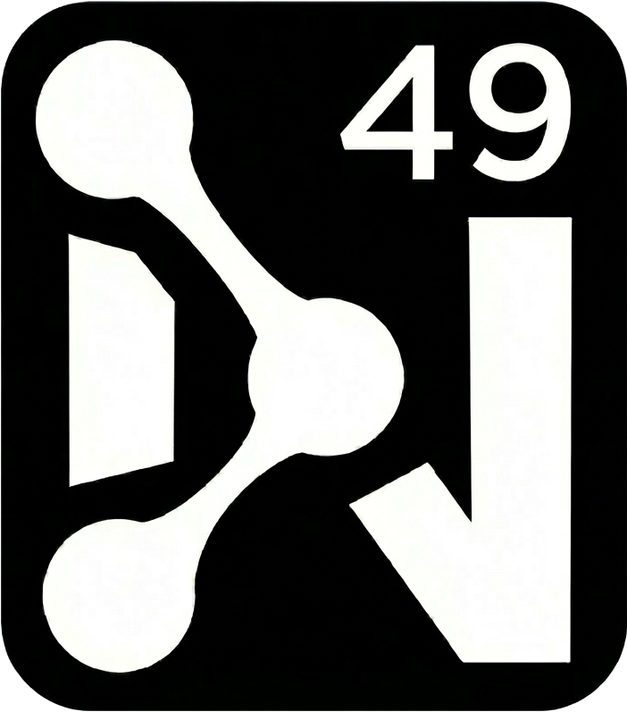

  
   
  <em>Build and Manage custom API endpoints for your Truckmate environment</em>

# NodalConnect-Docs
NodalConnect is an API server that integrates with Truckmate and allows the creation custom API endpoints.
This is where you can find the documentation.
